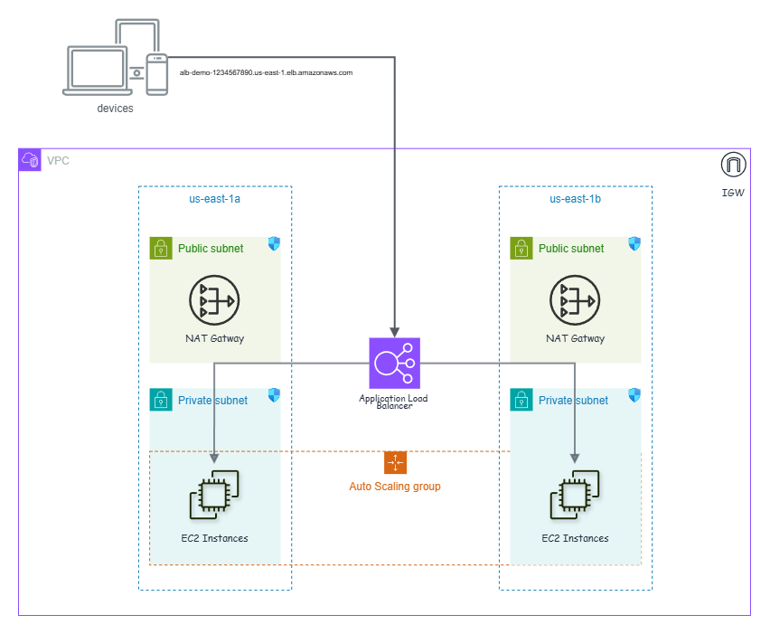

# **Introduction**  

In this demo, we explore **Application Load Balancer (ALB) session stickiness**, a feature that ensures a user’s requests are consistently routed to the same backend instance. This is particularly useful for applications that rely on session persistence, such as login-based web apps or shopping carts.  

We achieve this by deploying an **autoscaling group (ASG) of EC2 instances** behind an ALB. Initially, session stickiness is **disabled**, meaning requests are distributed randomly. Once enabled, the ALB assigns a session cookie (`AWSALB`) to the user, keeping them locked to a specific instance.  

Through a hands-on approach, we’ll see how stickiness works, how it reacts when an instance is stopped, and how disabling it restores normal load balancing behavior.  

This is a **zero-code, GUI-based deployment**, making it accessible for anyone looking to understand ALB stickiness without diving into the command line.O

# **Architecture Overview**  

This demo deploys a **highly available** and **secure** environment to test **ALB session stickiness**. The infrastructure is built within a **custom VPC** spanning **two Availability Zones (AZs)** for fault tolerance.  

#### **Network Setup**  
- **VPC:** A custom **VPC** is created to provide an isolated networking environment.  
- **Subnets:** Each AZ has **two subnets**—one **public** (for external-facing resources like the ALB) and one **private** (for backend EC2 instances).  
- **Internet Gateway (IGW):** Attached to the **public subnets**, allowing external traffic to reach the ALB.  
- **NAT Gateway:** Deployed in a **public subnet** to allow outbound internet access for instances in the **private subnets** (e.g., for software updates) while keeping them inaccessible from the internet.  

#### **Compute & Load Balancer**  
- **Application Load Balancer (ALB):**  
  - Launched in **public subnets**, distributing traffic across EC2 instances.  
  - A **listener** on **port 80** forwards requests to the **target group**.  
  - Initially, stickiness is **disabled**, but we enable it later to test session persistence.  
- **Auto Scaling Group (ASG):**  
  - Deploys EC2 instances **only in private subnets**, improving security.  
  - Uses a **Launch Template** that defines:  
    - Instance type (`t2.micro`)  
    - Security settings  
    - User data script (installs Apache and serves a simple webpage)  
  - Scales between **3 (desired)** and **6 (max)** instances based on demand.  

#### **Security**  
- **Security Groups (SGs) enforce access control:**  
  - **ALB Security Group** allows inbound **HTTP (port 80)** from the internet.  
  - **EC2 Security Group** only accepts HTTP traffic **from the ALB SG**, ensuring instances aren’t directly accessible.  

| **Component**      | **Description** |
|--------------------|---------------|
| **VPC** | Custom VPC with 6 subnets (3 public, 3 private) |
| **Subnets** | Public for ALB, Private for EC2 instances |
| **NAT Gateway** | Allows private instances to access the internet |
| **Internet Gateway** | Enables external access to the ALB |
| **ALB** | Public-facing, distributes traffic to instances |
| **Target Group** | Contains EC2 instances, initially without stickiness |
| **Auto Scaling Group** | Deploys EC2 instances into private subnets |
| **Launch Template** | Defines EC2 instance configuration |
| **Security Groups** | Controls inbound/outbound traffic |

---

# **Stickiness Testing - Step-by-Step Guide**  

Once the infrastructure is deployed, we can test **Application Load Balancer (ALB) Stickiness** to see how it affects traffic distribution. Follow the steps below to observe how session stickiness works in real time.  

---

#### **🛠️ Step 1: Deploy the CloudFormation Template**  
1. Navigate to the **CloudFormation** section in the AWS Console.  
2. Upload the CloudFormation template from the `cloudformation` directory.  
3. Click **Create Stack** and follow the on-screen instructions.  
4. Wait for the stack creation to complete (**status: CREATE_COMPLETE**).  

---

#### **🌐 Step 2: Access the Load Balancer**  
1. Go to the **EC2 Console** → **Load Balancers**.  
2. Find the **ALB (Application Load Balancer)** created by the CloudFormation stack.  
3. Copy the **Public DNS** of the ALB.  
4. Open a web browser and paste the **ALB Public DNS** into the address bar.  
5. Press **Enter** to load the page.  

---

#### **🔄 Step 3: Observe Load Balancing Without Stickiness**  
1. Refresh the browser multiple times (**F5** or **Ctrl + R**).  
2. Each time you refresh, the page should display:  
   - A **random cat picture**.  
   - A different **EC2 instance ID** at the top.  
3. This confirms that the **ALB is distributing traffic across multiple instances** without any session stickiness.  

---

#### **🛠️ Step 4: Enable Stickiness**  
1. Go to **EC2 Console** → **Target Groups**.  
2. Select the **Target Group** associated with the ALB.  
3. Click the **Group Details** tab.  
4. Scroll down to the **Attributes** section and click **Edit**.  
5. Check the **Stickiness** box.  
6. Set a duration (e.g., **1 minute**) and click **Save changes**.  

---

#### **🔄 Step 5: Observe Load Balancing With Stickiness**  
1. Go back to your browser and refresh the page multiple times.  
2. You should now see that **the same instance is being used** every time.  
3. The cat picture remains the same, and the **Instance ID does not change**.  
4. This happens because the ALB assigns a session cookie (`AWSALB`) to your browser, keeping your session on the same instance.  

---

#### **🔍 Step 6: Explore the ALB Stickiness Cookie (Optional)**  
If you want to dig deeper, you can inspect the ALB’s session cookie:  

#### **For Chrome Users**  
1. Right-click on the webpage → Click **Inspect**.  
2. Go to the **Application** tab.  
3. Under **Storage**, click **Cookies**.  
4. Select the **ALB Public DNS**.  
5. Look for a cookie named `AWSALB` – this is the session stickiness cookie.  

#### **For Firefox Users**  
1. Click **Tools** → **Web Developer** → **Storage Inspector**.  
2. Navigate to **Cookies** and look for the `AWSALB` cookie.  
3. This cookie is what keeps your session on the same instance.  

---

#### **🛠️ Step 7: Disable Stickiness and Observe Changes**  
1. Go back to **EC2 Console** → **Target Groups**.  
2. Select the **Target Group**.  
3. Click **Edit** under **Attributes**.  
4. Uncheck the **Stickiness** box and click **Save changes**.  
5. Return to the browser and refresh multiple times.  
6. The **Instance ID should start changing again**, confirming that traffic is now distributed freely.  

---

Through this process, you have successfully tested and observed how ALB Stickiness works, from distributing traffic randomly to locking sessions to a single instance and then returning to normal load balancing when stickiness is disabled.

# **Cleanup**

Once you've finished testing **ALB Stickiness** and verified its functionality, it's important to clean up the resources to avoid unnecessary charges. Follow the steps below to remove all components created during the demo.

1. **Delete the CloudFormation Stack**  
   - Navigate to the **CloudFormation Console**: [CloudFormation Console](https://console.aws.amazon.com/cloudformation/home?region=us-east-1#/stacks).
   - Select the stack that was created for the **ALB Stickiness Demo**.
   - Click on the **Delete** button to remove the stack and all associated resources (VPC, EC2 instances, ASG, ALB, etc.).
   - Confirm the deletion by clicking **Delete Stack**.  
   - Wait for the stack to be deleted completely. It may take several minutes.

2. **Manually Check for Remaining Resources (if necessary)**  
   Although CloudFormation handles most of the cleanup, you may want to check the following in case some resources remain:
   - **EC2 Instances**: Check the EC2 Console to ensure all instances have been terminated.
   - **Elastic IP**: If you manually allocated any Elastic IPs for the NAT Gateway, release them.
   - **Load Balancer**: Verify that the ALB is deleted from the **Load Balancers** section of the EC2 Console.
   - **Security Groups**: Make sure the security groups created specifically for the demo are deleted.
   - **Target Groups**: Check if any target groups remain in the EC2 Console and delete them.

3. **Optional: Check Billing**  
   After cleanup, it's a good idea to review your AWS billing dashboard to confirm that no unnecessary resources are still running and incurring charges.

# **Extras: Real-World Applications of ALB Stickiness**  

In real-world production environments, **ALB stickiness** can be incredibly useful for applications that require session persistence. One common use case is **e-commerce websites**.  

#### **Scenario: Shopping Cart in an E-Commerce Website**  
Imagine a user browsing an online store and adding items to their cart. If the application stores the cart data **only in the instance’s memory**, it’s important that the user keeps interacting with the same instance throughout their session. Otherwise, if the ALB routes the user to a different instance, their cart data could be lost.  

By enabling **ALB stickiness**, the user's session is always routed to the same instance, ensuring that their shopping cart remains intact. However, this approach has a major pitfall: **if the instance fails or is terminated, the session data is lost**.  

#### **Improved Approach: Using a Distributed Session Store**  
A more robust solution would be to use **application-based stickiness** combined with a **cache-based session store** such as **Redis or Memcached**. In this case:  
- The application sets its own **session cookie**, which is stored in the user’s browser.  
- The session data (e.g., shopping cart items) is stored in **Redis or Memcached** instead of the instance’s memory.  
- The ALB still routes requests to the same instance when possible.  
- If the instance becomes unavailable, the ALB redirects traffic to another instance, which can retrieve the session data from the cache.  

This hybrid approach provides **both session persistence and fault tolerance**, making it a more scalable and reliable solution for production systems.  

### **Other Use Cases for ALB Stickiness**  
1. **User Authentication Sessions** – Ensuring a user remains on the same instance after logging in.  
2. **Real-Time Analytics Dashboards** – Keeping users connected to the same backend for consistent data retrieval.  
3. **Streaming Services** – Maintaining a stable connection with a specific server during a streaming session.  

While ALB stickiness can be helpful, it’s important to evaluate whether **a stateless architecture with a distributed session store** would be a better fit for your use case.